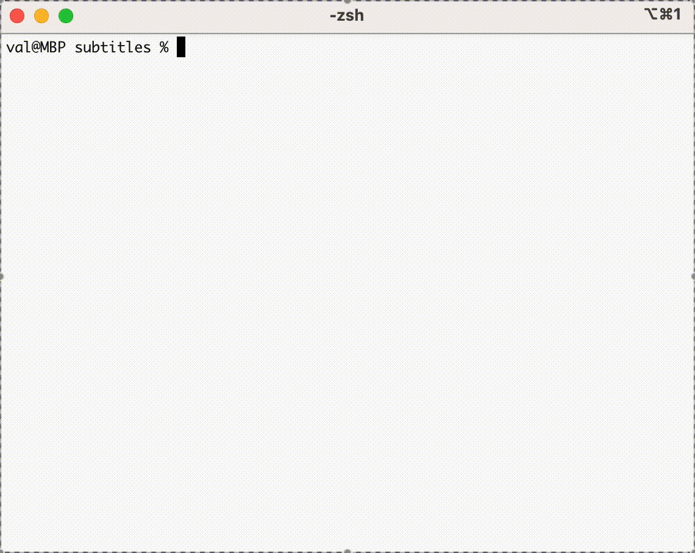

# Subtitles.py
Petit script python pour décaler des fichiers .srt

## Requirements 
python - [installer python](https://www.python.org/about/gettingstarted/)

une fois python installé s'assurer d'avoir les packages suivants installés :

- [simple-term-menu](https://pypi.org/project/simple-term-menu/) : permet d'afficher les .srt disponibles dans votre dossier via un menu 
- [chardet](https://pypi.org/project/chardet/) : détecte l'encoding du fichier original

Les deux peuvent être installé via :

    python -m pip install simple_term_menu chardet

## Utilisation 

1. Dans le dossier dans lequel se trouve le script, placer les fichiers .srt que vous venez de télécharger et que vous avez besoin de décaler.
2. Lancer le script via :

        python subtitle.py
3. Selectionnez le fichier 
4. Indiquez si vous souhaitez ajouter du délai ou en enlever 
5. Indiquez le nombre de secondes (si pas de décallage de seconde souhaité ne mettez rien ça mettra 0 par défaut)
6. Indiquez le nombre de ms (si pas de décallage de ms souhaité ne mettez rien ça mettra 0 par défaut)
7. Le fichier est enregistré dans votre dossier

## Demo

